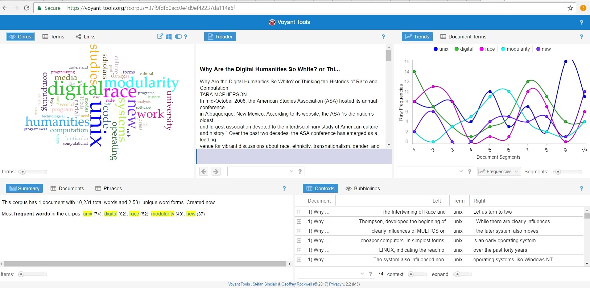
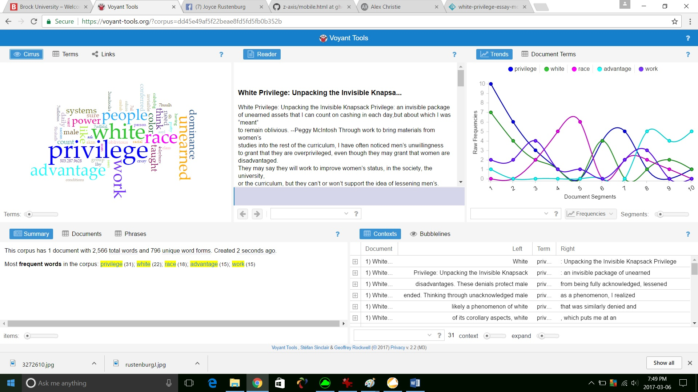
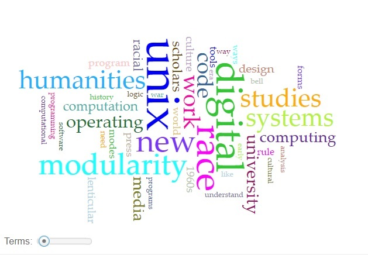
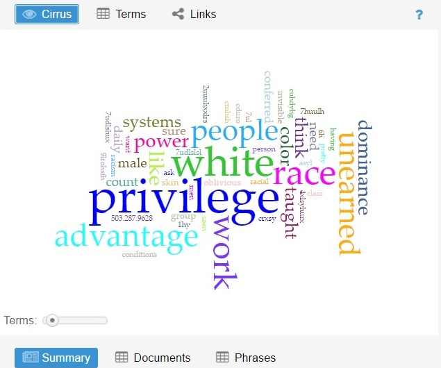
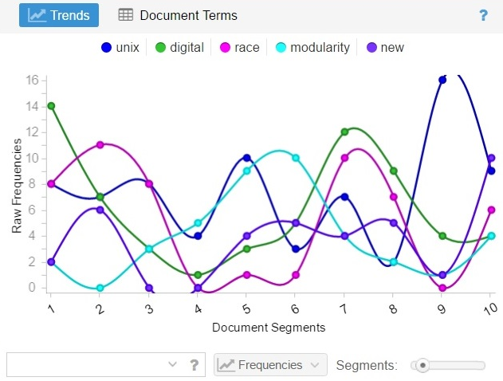
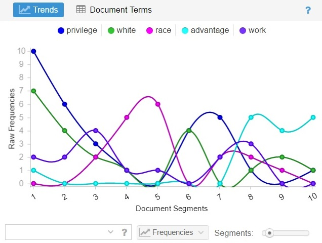
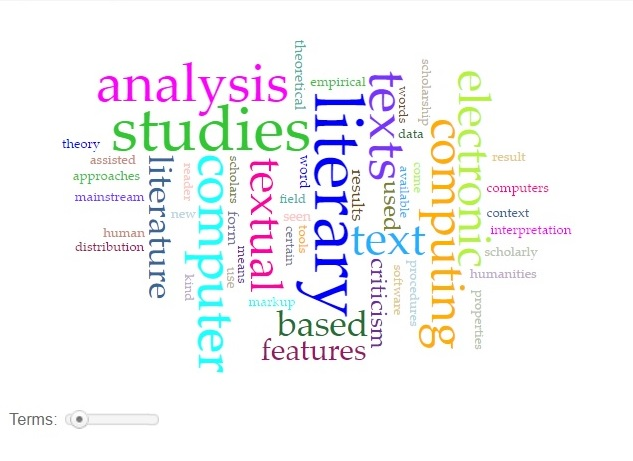
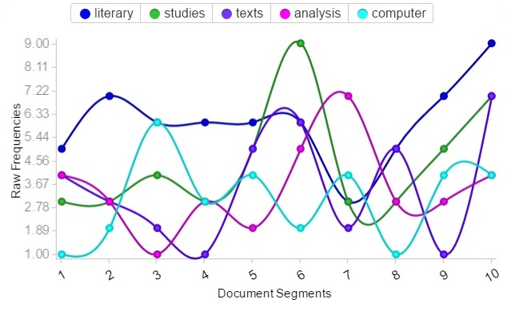
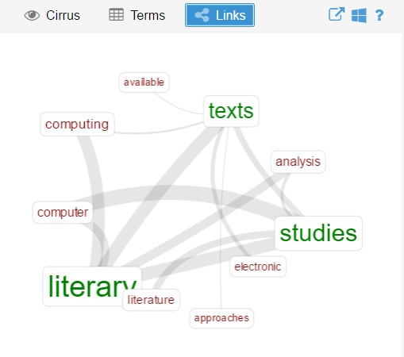
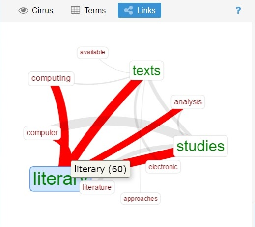

##   Tara McPherson: Why are the Digital Humanities so White? or Thinking the Histories of Race and Computation
#### 2012 Print Edition 
###  A Traditional Critical Analysis and A DH Textual Analysis using Voyant Tools

Why is McPherson's question so important? If the digital humanities (DH) are mostly white, then whose interests are serrved, what texts are investigated and published, what questions are asked and answered, whose research is done? If whites are heavily represented, then whose voice is heard, what data is skewed because of only a partial picture, what is the focus of DH work and who is oppressed by that? McPherson uses a parallel structure to uncover similarities between the UNIX operating system and Race, as an oppressive social system, both from a historical perspective. If there is a white vs. non-white perspective as McPherson discusses, I argue that there is also a gendered perspective, a male vs. female or non-male perspective. This is shown by the high numbers of men influential in the Science, Technology, Engineering, and Mathematics (STEM) fields where UNIX and other operating systems originated. 

McPherson's argument 'why' is a comparison structured by a lenticular lens, a parallel of two separate systems, first one and then the other, but never a mixture of the two. She shows how over time situations changed and the systems, UNIX and race, became harder to work from within for those affected. 

   **Unix**    |   **Race**
  ---------------- | -------------------
  operating system |  social system
  computer         |  people
  technical        |  humanities

I will use two types of academic analysis, the first is a traditional examination of the article by critically examining its arguments  and checking its suggestions or conclusions. The second is by using a DH tool, [Voyant](http://voyant-tools.org/), to analyze the article and study statistics about it and my other two supporting articles Peggy MacIntosh's "_White Privilege: Unpacking the Invisible Knapsack"_ and Thomas Rommel's "_A Companion to Digital Humanities"_.

###  Traditional Analysis of Texts

#### Sociological Lens
Social scientists use a variety of techniques (e.g., surveys, experiments) to help them “see” the social world (Brym: 525). At first most [social scientists and policymakers] believed that the Internet would enhance equality of access to information by reducing its cost. As technoeuphoria wore off, however, observers noted that some kinds of people used the Internet more than others and that those with higher access also had greater access to education, income, and other resources that help people get ahead (DiMaggio: 549).
Higher education “has always been closely related to social-class background” (Brym: 328). At one Canadian university “students [e.g., women, Jews, Ukranians, Poles, Dutch, Norwegians, Germans, Italians, and Mennonites at the University of Manitoba] needed much higher marks than the “preferred” students [who] were Anglo-Celtic Protestant and Catholic (Brym: 329).
Conflict theory views society as a site of struggle between groups with different kinds and amounts of power and resources…Groups with more power are likely to control schooling and to impose their culture on it (Brym: 322).
“Conflict analysis draws attention to the question of whose knowledge is reflected in schools, and which groups are served by the norms that schools foster” (Brym: 323). “Schools, like the society, are controlled by the relatively powerful, educational change depends on change in relations of power outside the school system” (Brym: 324).
Unequal power relations result in economic inequality, class difference, and dominance through schooling for people (Brym).

####  Feminist Lens

**Race and Gender Inequalities--A Hierarchy of Race and Gender**
“Humans … naturally favour members of their own ethnic or racial group—their ‘relatives’—and have a natural distrust and dislike of ‘nonfamily’ members” (Brym: 221).
“Power, prestige, and material well-being are often interrelated…historically, women have been excluded from certain types of activities that create opportunities for acquiring power, prestige, and wealth” (Brym: 190). 

####  Feminism described as first, second, and third waves. 

For the purpose of this article I am using the simplified description of feminism into three waves in order to remind us of the connections of race, gender, technology, and the academy. The first wave of feminism (Henslin et al., 2007: 153) was the fight for the right to vote; the primary goal was the struggle to grant to vote to middle class women, 1835-1920 (Crowe: 59, 60). The second wave of feminism, the rise of feminism in the mid 1960s along with other movements including the civil rights movement in the United States (Crow: 59). The third wave of feminism, late 1980s, 1990-1999 (Crow, 2009: 37, 59) brought out, uncovered, “the recognition that Canadian social institutions perpetuate racism” … and led to “epistemological questions of how to theorize the inter-connection between race and gender and continue to document how racial differences are created between women” (Crow: 37).

How education is delivered is important because the manifest function or intended purpose of formal education is knowledge, training students in reading, writing, and arithmetic, as well as many other subjects. “Canadians spend much of their lives in classrooms,” affected by “a hidden curriculum, in our schools … where the latent function of education, the inculcation of values that, though not explicitly taught, form an inherent part of a school’s message” (Henslin: 71). The hidden message, women are not good at nor found in STEM (Science, Technology, Engineering, & Mathematics https://www.ed.gov/stem ) classes compared to the Arts disciplines. 

McPherson uses a historical view and I suggest gender is a big part of the subjects of UNIX and race from the feminist lens of 'waves' of feminism, first, second, and third. 
The first wave about ...
The second wave about ...
The third wave about ...

- - - - - 

A Parallel Structure of Unix and Race, White Privilege: Unpacking the Invisible Knapsack, Using Voyant, A Text Analysis Tool

I refer to the article ["Why are the Digital Humanities so White?"](http://dhdebates.gc.cuny.edu/debates/text/29) by Tara McPherson who asks this question. She addresses two groups, technological and from the humanities who are or seem to be in different camps or silos in 'the academy' and who have different audiences. To discuss this question she draws a parallel between the UNIX operating system and media and race, to demonstrate looking through a lenticular lens. This lens type can show one image, or the other, but not both images at the same time or a merged version, e.g., her example of a postcard of two 3-D images. Her parallel structure is good for comparison as she talks about one concept, then the other, to compare how they bound their respective entities first in the mid 1960s and then much later on. McPherson's article is helpful to explain the point of view to each group from the perspective of the other group.

> Both the computer and the lenticular lens mediate images and objects, changing their relationship but frequently suppressing that process of relation, much like the divided departments of the contemporary university. The fragmentary knowledges encouraged by many forms and experiences of the digital neatly parallel the logics that underwrite the covert racism endemic to our times, operating in potential feedback loops, supporting each other. If scholars of race have highlighted how certain tendencies within poststructuralist theory simultaneously respond to and marginalize race, this maneuver is at least partially possible because of a parallel and increasing dispersion of electronic forms across culture, forms that simultaneously enact and shape their new modes of thinking (13). 

### Article Analysis, A Parallel Structure of UNIX and Race

Unix and race are separate entities which McPherson looks at through a lenticular lens. She uses a parallel structure to explain why the digital humanities are so white. 

- Structural separation

1. About UNIX. UNIX _embeds information_, hiding it from users of the system but transparent to creators of applications. The application programmers cordon off users from areas of the program they do not want users to see or access or change. It does so by modularity and use of shells.

2. About RACE. Our bodies _embody information_ such as race and culture. Judgements are made, e.g., by media, employers, according to visual representations. According to a structured hierarchy of white / other, where 'white' may be or is preferred and 'other' may or is not. The other are cordoned off and prevented from accessing jobs, services and/or programs that owners/managers of the system do not want them to access. 

3. A supporting document to McPherson, is Peggy McIntosh's _White Privilege, Unpacking the Invisible Knapsack_    outlines the 
"_Privilege: an invisible package of unearned assets that I can count on cashing in each day, but about which I was “meant” to remain oblivious"_. McIntosh writes a numbered list advantages of being white that come implicitly in an 'invisible knapsack' that she has taken for granted as a white person. She shines a spotlight on the white privilege that most [whites] take for granted and do not notice. _"One factor seems clear about all of the interlocking oppressions. They take both active forms which we can see and embedded forms which as a member of the dominant group one is taught not to see"_ (McIntosh).

4. Why were the digital humanities so white, sheds light on why are the 1% still so white? The system supports itself, 'the master's tools' are white, the system, as McPherson points out, is structured so that it feeds the white and stifles the other, first overtly before the mid 1960s then covertly after that. White, upper class, educated men have the privilege to continue the system. In the mid 1960s there were race riots and the second wave of feminism to counter act that system of privilege. This is a political subject as those who controlled the Internet and early computers were the government and the military. The government still controls schools and education. Who controls the media and networks but corporations who pay for air time through commercials and advertisements. Who controlled the government, education, and corporations but white, upper class, educated men.

5. Changes came about from second wave feminism, to work toward gender equality and third wave feminism in the early 1990s brought many aspects including action and support for women of colour. Feminism could push back against inequity. People had to recognize inequity and that is why I have included Peggy McIntosh's paper on _White Privilege, Unpacking the Invisible Knapsack._ The goal is to break down the barriers to allow inclusion in the Digital Humanities, academia, or elsewhere.

#### Pre UNIX

i studied assembly language on a Von Neumann machine/processor, with do-it-yourself data structures carved out, with SAL, MAL, and TAL (True Assembly Language). One could argue that programming in assembly was complicated in that it required keeping track of the space used, being careful not to overwrite areas by keeping the data structures in the program 'segregated' manually in the program. One could also argue that it was simple, transparent, and hands-on.

#### UNIX and mid 1960s

The operating system Unix overtook Von Neumann's machine programmed with asssembly language. UNIX had shells and used modularity, making it less open and accessible than previous opreating systems programmed with assembly language. 

  **Unix**   |        **Race**
  ------ | -----------------------------
  modular |  overt racism
  shell   |  segregation

#### Late 1990s

**Unix, Java** |       **Race**
------------ | --------------------------------
modular |  covert racism
OOP |  feedback loops further racism

Structures responding to and marginalizing race - feminism, there is no one woman's story, but many stories, the one/the other and the question is "Who benefits?" and difference, the other always in relation to the one, but the other can never be 'the one.' Previous to this was the male as bread winner, vs. the 'person of colour' male bread winner.

### Digital Humanities (DH) and Voyant Text Analysis tools

As Thomas Rommel writes, 
> The history of literary computing, however, shows that only a limited number of textual phenomena can be analyzed profitably in the context of quantitative and qualitative computer-based analyses of style. These phenomena have to be linked to some surface features that can be identified by electronic means, usually by some form of pattern matching. Computers are exceptionally well suited for this kind of analysis, and only human intuition and insight, in combination with the raw computing power of machines programmed to act as highly specialized electronic tools, can make some texts or textual problems accessible to scholars.

Article link: [Thomas Rommel](http://www.digitalhumanities.org/companion/view?docId=blackwell/9781405103213/9781405103213.xml&chunk.id=ss1-2-8&toc.depth=1&toc.id=ss1-2-8&brand=default)

An example:
This text analysis visualization, presents evidence that supports my core argument. 
The text analysis tool I used was [Voyant](https://voyant-tools.org). Here is the text analysis document window after I pasted in the text from the article, 
. The results of the text analysis: This corpus has 1 document with 10,231 total words and 2,581 unique word forms. Created now.
Most frequent words in the corpus: unix (74); digital (62); race (52); modularity (40); new (37).
- In the word map of the text the size of the text is in direct proportion to the number of times the word is found in the corpus.
The corpus, or the text in the document is shown between the word map and the graph. The curves in the graph show the analysis of the word count of the corpus, the article by McPherson.
Following is the Voyant text analysis of Peggy McIntosh's article.

### Voyant Text Analysis of Peggy McIntosh's _White Privilege_

This corpus has 1 document with 2,566 total words and 796 unique word forms. Created 2 seconds ago.
Most frequent words in the corpus: privilege (31); white (22); race (18); advantage (15); work (15)

  **McPherson - Word cloud**   |        **McIntosh**
  ------ | -----------------------------
  overt and covert racism |  white privilege sustains racism
     |  

  **McPherson - Graph**   |        **McIntosh**
  ------ | -----------------------------
  overt and covert racism |  white privilege sustains racism
     |  
  
### Voyant analysis of Rommel's text

This corpus has 1 document with 3,800 total words and 1,126 unique word forms. Vocabulary Density: 0.296
Average Words Per Sentence: 30.4  
Most frequent words in the corpus: literary (60); studies (45); texts (36); analysis (35); computer (31)

  **Rommel's - Word cloud**   |        **Rommel's - Line Graph**
  ------ | -----------------------------
  freq. by font size   |   freq. by line graph
  |  
Links: Literary    |   Literary highlighted with mouse, red links
  |   

The links button on the Voyant panel shows Voyant's analysis of Rommel's article; clicking on a button shows the links it connects to, in this case when the Literary button is clicked the connecting links turn red.

<.><.><><>

We have read about the parallel structure, programmers and technical people would recognize the separation of operating system and applications run on the system from users. The humanities have discussed the personal and the political, rules and laws are made in the public sphere and can be changed, e.g., segregation, separation. Social justice workers work to break these barriers from inside and outside the system. McPherson discusses the mid 1960s, and the later. This work is not done, until we look but no longer see the question "Why are the digital humanities so white?"

Works Cited

Brym, Robert J. New Society, Sociology for the 21st Century. 2nd Ed. Toronto, Canada: Harcourt Brace Company Canada Ltd, 1998.

Crow, Barbara A. and Lise Gotell, Eds. Open Boundaries, A Canadian Women’s Studies Reader. 3rd Ed. Toronto, Canada: Pearson Canada Inc. 2009.

DiMaggio, Paul, Eszter Hargittai, Coral Celeste, and Steven Shafer. Digital Inequality, From Unequal Access to Differential Use in The Inequality Reader. Boulder, Colorado: Westview Press, 2007.

Henslin, James M., Dan Glenday, Ann Duffy, Norene Pupo. Sociology, a down-to-earth-approach. 4th Canadian Ed. Toronto, Canada: Pearson Education Canada, 2007.

McIntosh, Peggy. "White Privilege: Unpacking the Invisible Knapsack" https://www.pcc.edu/resources/illumination/documents/white-privilege-essay-mcintosh.pdf accessed March 3, 2017. From 
McIntosh, Peggy. White Privilege and Male Privilege: A Personal Account of Coming to See Correspondences Through Work in Women's Studies. Wellesley, MA: Wellesley College, Center for Research on Women, 1988. Print.

McPherson, Tara. 2012 Print Edition. “Why Are the Digital Humanities So White? or Thinking the Histories of Race and Computation”  http://dhdebates.gc.cuny.edu/debates/text/29 accessed March 3, 2017.

Rommel, Thomas. A Companion to Digital Humanities, ed. Susan Schreibman, Ray Siemens, John Unsworth. Oxford: Blackwell, 2004. 
http://www.digitalhumanities.org/companion/

Reference
[digital humanities companion](http://www.digitalhumanities.org/companion/)

